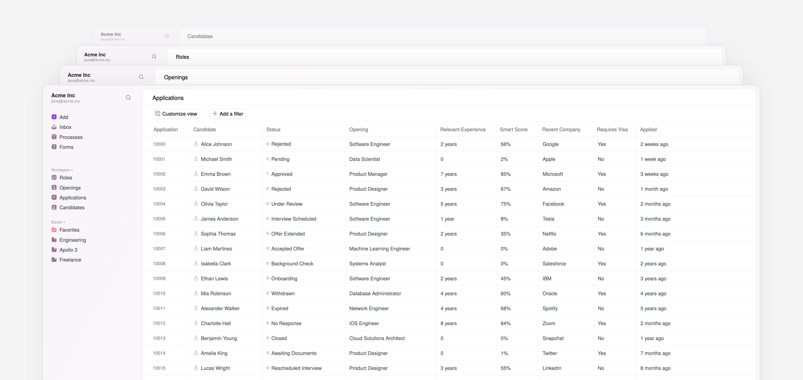

<p align="center">
  <a href="https://ornelle.co">
    <picture>
      <source media="(prefers-color-scheme: dark)" srcset="./docs/assets/ornelle-light.png">
      
    </picture>
  </a>
</p>

<h1 align="center">Modern, open-source ATS</h1>

<a href="https://ornelle.co">
  
</a>

<hr />

<p align="left" style="margin-top: 1.25rem;">
Ornelle is a comprehensive hiring platform built from the ground up for flexibility, speed, ease and AI-assisted workflows.
</p>

<hr />

## Features

- **Multi-workspace Support**: Manage multiple organizations or teams with isolated workspaces
- **Career Pages**: Simple, customizable career and opening pages
- **Application Management**: Track and process applications with customizable workflows
- **Candidate Communication**: Send and receive messages to and from candidates

- **Saved Views & Entities** | **Custom Fields** | **Advanced Filtering** | **Messaging Templates** | **Form Builder** 
- **Modern UI** | **API-First Design** | **File Handling** | **Self-hosted**

- And much more...
<!-- - **Messaging Templates**: Customizable email templates for candidate communication
- **Form Builder**: Create custom forms for candidate applications
- **Custom Fields**: Represent additional information with first-class custom fields
- **Advanced Filtering**: Filter candidates based on custom fields
- **Saved Views & Entities**: Save and reuse your views and entities
- **Modern UI**: Clean, responsive interface built with React and Tailwind CSS
- **API-First Design**: Well-documented APIs for extensibility and integration
- **File Handling**: Support for local storage or AWS S3/CloudFront integration
- **Self-hosted**: Full control over your data and infrastructure
- And much more... -->

## Getting Started

### Prerequisites

- Node.js (v22 recommended)
- pnpm (v8 or later)
- PostgreSQL (v14 or later)
- Redis (v6 or later)

### Installation

1. Clone the repository

```bash
git clone https://github.com/ornellehq/ornelle.git
cd ornelle
```

2. Install dependencies

```bash
pnpm install
```

3. Run the interactive setup script

```bash
node setup.js
```

This script will:
- Copy .env.sample files to .env files for all packages
- Guide you through configuring key environment variables with an interactive UI
- Run database migrations

Alternatively, you can manually configure:
```bash
cp packages/server/.env.sample packages/server/.env
cp packages/webapp/.env.sample packages/webapp/.env
cp packages/webpages/.env.sample packages/webpages/.env
# Edit the .env files with your settings

# Run migrations manually
cd packages/isomorphic-blocs
pnpm migrate:apply
cd ../..
```

5. Start development servers

```bash
pnpm dev
```

The application should now be running on:
- Web App: http://localhost:5173
- API Server: http://localhost:3001
- Public Pages: http://localhost:4321

## Architecture

Ornelle is built as a monorepo with the following packages:

- **webapp**: Vite-based React frontend application
- **server**: Fastify backend API server
- **webpages**: Astro-powered public career pages
- **isomorphic-blocs**: Shared business logic and database schemas
- **sdks**: Generated API clients
- **lib**: Shared utilities
- **webui-library**: Reusable UI components

## Configuration

### Storage Options

Ornelle supports two storage providers:

1. **Local Storage**: Files are stored on the local filesystem (default)
2. **AWS S3/CloudFront**: Files are stored in S3 with CloudFront for content delivery

To configure AWS storage:

```
# In packages/server/.env
Storage={"provider":"aws","aws":{"Bucket": "your-bucket-name", "Region": "your-region", "S3AccessKey": "your-access-key", "S3SecretKey": "your-secret-key", "CloudFrontPrivateKey":"your-private-key", "CloudFrontKeyPairId":"your-key-pair-id", "CloudFrontDomain":"your-cloudfront-domain"}}
```

## Documentation

More detailed documentation is available in the [docs](./docs) directory.

- [Developer Guide](./docs/DEVELOPMENT.md)
- [Architecture Overview](./docs/ARCHITECTURE.md)
- Deployment Guide (WIP)
- API Documentation (WIP)
<!-- - [Deployment Guide](./docs/DEPLOYMENT.md) -->
<!-- - [API Documentation](./docs/API.md) -->


## License

Ornelle ATS is licensed under the [GNU Affero General Public License v3.0](./LICENSE.md).

This license requires that:
- You give credit to the original authors
- You disclose your source code when distributing the software
- If you modify the software and offer it as a network service, you must make the modified source code available to users of that service

## Project Status

We are working on deployment guides. Until then, Open-source Ornelle is suitable for testing and evaluation purposes.

For production use, you can try out the fully-hosted version of Ornelle available at [ornelle.co](https://ornelle.co), which is production-ready and includes all features of the open-source version and more.

---

<p align="center">
  Made with ❤️ by the Ornelle team
</p>
